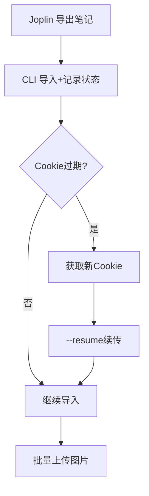

# MiNote Playwright Automation

使用 Playwright 自动化浏览器操作，通过请求拦截实现图片上传到小米云笔记。

## 原理

```
┌──────────────────────────────────────────────────────────────┐
│  Playwright 浏览器                                           │
│    ┌──────────────┐                                          │
│    │ 用户选择占位图 │ ──▶ page.route() 拦截 ──▶ 替换为真实文件  │
│    │ (1x1 像素)   │                                          │
│    └──────────────┘                                          │
│                          │                                   │
│                          ▼                                   │
│                   重新计算 MD5/SHA1                          │
│                          │                                   │
│                          ▼                                   │
│                   发送到小米云 KSS                            │
└──────────────────────────────────────────────────────────────┘
```

核心优势：**在浏览器发出请求前拦截，替换文件内容并重新计算哈希值**，从而绕过 KSS 签名验证。

## 安装

```bash
cd automation
npm install
npx playwright install chromium
```

## 使用方法

### 1. 获取浏览器 Cookie

登录 [i.mi.com/note](https://i.mi.com/note) 后：
1. 按 F12 打开开发者工具
2. 切换到 Network 标签
3. 创建一条测试笔记
4. 找到任意请求，复制 Request Headers 中的 `Cookie` 值
5. 确保包含 `serviceToken` 和 `userId`

### 2. 推荐方案 A2：CLI + Playwright 直接上传真实文件（最简单可靠）

**核心改进**：不再使用"占位图替换"的复杂逻辑，而是直接让浏览器选择并上传真实图片文件。

#### 第一步：用 CLI 创建笔记（纯文本）

```bash
# 在项目根目录
npm run import -- -f joplin-test-image.md -c "serviceToken=xxx;userId=123;..."
# 输出中会显示创建的笔记 ID，如：49590002881020480
```

#### 第二步：用 Playwright 直接上传真实图片

```bash
cd automation
node auto-upload-real.js \
  -c "serviceToken=xxx;userId=123;..." \
  -n "49590002881020480" \
  -i "../_resources/0523_1.jpg"
```

**特点**：
- ✅ 直接选择真实文件，不玩替换把戏
- ✅ 简化流程，减少出错点
- ✅ 浏览器窗口可见，便于调试
- ✅ 自动截图保存（before/after）便于验证

### 3. 完整批量导入流程（A2 方案）

```bash
# 1. 先用 CLI 批量导入纯文本（在项目根目录）
npm run import -- -d "./joplin-notes" -c "..." 2>&1 | tee import-log.txt

# 2. 从日志中提取笔记 ID，建立 ID->图片的映射
# 例如：创建 upload-map.json
{
  "49590002881020480": "./joplin-notes/_resources/img1.jpg",
  "49590002881020481": "./joplin-notes/_resources/img2.jpg"
}

# 3. 批量上传（逐个执行）
cd automation
node auto-upload-real.js -c "..." -n "49590002881020480" -i "./joplin-notes/_resources/img1.jpg"
node auto-upload-real.js -c "..." -n "49590002881020481" -i "./joplin-notes/_resources/img2.jpg"
```

### 4. 其他方案（备用）

#### 方案 A1：清单模式（最稳定但需手动）

```bash
# 生成待上传清单
node automation/generate-upload-list.js -d "./joplin-notes"

# 然后用户按清单手动在小米云客户端上传
```

#### 方案 B：请求拦截（已废弃，不稳定）

```bash
# 占位图替换方案，由于拦截不生效，已废弃
# node upload-images-only.js  # 不推荐使用
```

#### 调试模式

```bash
# 后台运行（看不到浏览器窗口）
node auto-upload-real.js --headless -c "..." -n "..." -i "..."
```

## 文件说明

| 文件 | 说明 | 状态 |
|------|------|------|
| `auto-upload-real.js` | **推荐**：直接上传真实图片（A2 方案） | ✅ 可用 |
| `batch-import.js` | 批量导入脚本（含图片解析） | ✅ 可用 |
| `mi-note-uploader.js` | 核心上传类（含请求拦截） | ⚠️ 复杂 |
| `upload-images-only.js` | 占位图替换方案（已废弃） | ❌ 不推荐 |
| `test-uploader.js` | 测试脚本 | ⚠️ 备用 |
| `debug-buttons.js` | 调试工具：查找页面按钮 | 🔧 工具 |
| `test-interception.js` | 调试工具：测试请求拦截 | 🔧 工具 |
| `placeholders/placeholder.jpg` | 1x1 像素占位图片 | 📁 资源 |

## 推荐工作流程（带进度记录）



### 1. 带状态记录的批量导入

```bash
# 第一步：导入笔记（自动创建状态文件，在项目根目录）
npm run import -- \
  -d "./joplin/笔记本" \
  --with-images \
  --state-file ./import-state.json \
  -c "serviceToken=xxx;userId=xxx"

# 输出：
# [进度] 总计: 150 | 完成: 45 | 失败: 0 | 待处理: 105
# [进度] 状态文件: ./import-state.json
```

### 2. Cookie 过期后断点续传

```bash
# 获取新 Cookie 后，继续导入
npm run import -- --resume ./import-state.json -c "新Cookie..."

# 自动跳过已完成的 45 个，继续处理剩余 105 个
```

### 3. 批量上传图片

```bash
cd automation
node batch-upload.js -s ../import-state.json -c "serviceToken=xxx;userId=xxx"
```

## 其他方案

### 单笔记直接上传（无状态记录）

```bash
# 导入（在项目根目录）
npm run import -- -f note.md -c "..."

# 上传（替换 ID 和图片路径）
cd automation
node auto-upload-real.js -c "..." -n "ID" -i "path/to/img.jpg"
```

## 工作流程

1. **解析 Markdown**：提取 `` 格式的图片引用
2. **生成占位图**：为每个真实图片创建一个小的占位 JPEG
3. **建立映射表**：占位图文件名 → 真实图片路径
4. **创建笔记**：通过 Playwright 在浏览器中创建笔记
5. **触发上传**：选择占位图触发上传对话框
6. **拦截替换**：`page.route()` 拦截 KSS 上传请求，替换为真实文件并重新计算哈希
7. **完成**：小米云服务器保存真实图片

## 注意事项

1. **Cookie 有效期**：Cookie 通常几小时过期，需要定期更新
2. **网络环境**：确保网络稳定，上传中断可能导致图片损坏
3. **文件大小**：大文件上传可能需要更长时间，增加 `--no-headless` 观察进度
4. **文件映射**：占位图文件名包含原文件名信息，用于匹配替换

## 故障排除

### 登录失败
```
Cookie login failed, switching to interactive mode...
```
这是正常的，脚本会自动切换到交互模式，显示浏览器窗口让你手动登录。

### 图片未正确替换
```
[Intercept] No mapping found for: xxx.jpg
```
检查文件映射表是否正确建立，占位图文件名是否匹配。

### 上传超时
增加等待时间或降低并发：
- 修改 `mi-note-uploader.js` 中的 `waitForTimeout` 值
- 在 `batch-import.js` 中增加循环间的延迟

## 技术细节

### 请求拦截点

```javascript
// 拦截 KSS 上传请求
if (url.includes('xmssdn.micloud.mi.com')) {
  // 替换文件内容
  const newContent = fs.readFileSync(realImagePath);
  
  // 重新计算哈希
  const newMd5 = calculateMd5(newContent);
  const newSha1 = calculateSha1(newContent);
  
  // 更新 headers
  headers['content-md5'] = newMd5;
  headers['x-kss-sha1'] = newSha1;
  headers['content-length'] = String(newContent.length);
  
  // 继续请求
  await route.continue({ headers, postData: newContent });
}
```

### 为什么这个方法有效

1. **浏览器计算原始哈希**：用户选择占位图后，网页 JS 计算占位图的 MD5/SHA1
2. **请求拦截**：在浏览器发出 HTTP 请求前，Playwright 拦截
3. **替换内容**：将占位图内容替换为真实图片
4. **重新计算哈希**：计算真实图片的 MD5/SHA1，更新 headers
5. **服务器验证通过**：KSS 服务器收到正确的哈希值，验证通过

## 安全提醒

- Cookie 包含登录凭证，**不要分享给他人**
- 仅在个人电脑运行，确保环境安全
- 定期更换小米云密码
